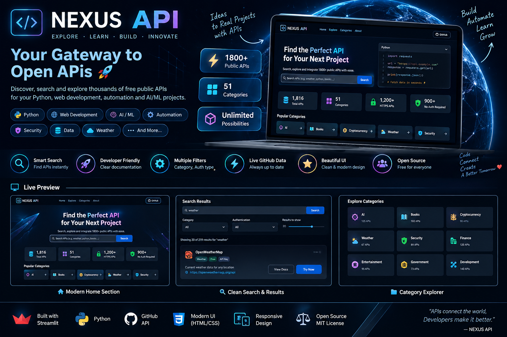

  

<h1 align="center">⚡ NEXUS API — Public API Explorer</h1>

  Discover, search and explore public APIs for Python, Web Development, Automation, AI/ML, Security and more.

  
  
  
  

🚀 About the Project

NEXUS API is a modern Public API Explorer built with Python + Streamlit.

It loads the public API catalog from the public-apis/public-apis GitHub repository and provides a clean dashboard to quickly discover APIs for real-world projects.

You can search APIs, filter by category and authentication type, check HTTPS/CORS support, and open the API documentation directly.

✨ Features

🔎 Instant API search

🧩 Category filtering

🔐 Authentication filtering

🔒 HTTPS information

🌐 CORS information

⚡ Live GitHub catalog

📊 API statistics

🖥️ Advanced developer-style UI

📱 Responsive design

🔗 Direct documentation links

🛟 Built-in fallback data if GitHub is unavailable

🛠️ Tech Stack

Technology

Purpose

Python

Main programming language

Streamlit

Web application UI

Pandas

API data handling

Requests

Fetch GitHub catalog

HTML/CSS

Advanced visual design

GitHub

Source + public API data

📂 Project Structure

public_api_explorer/
│
├── app.py
├── requirements.txt
├── README.md
├── .gitignore
│
└── assets/
    └── nexus-api-banner.png

⚙️ Installation

Clone the repository:

git clone YOUR_GITHUB_REPOSITORY_URL
cd public_api_explorer

Create a virtual environment:

python -m venv .venv

Install requirements:

pip install -r requirements.txt

Run the application:

streamlit run app.py

Then open:

http://localhost:8501

🪟 Windows PowerShell

If virtual environment activation is blocked, use:

python -m venv .venv
.\.venv\Scripts\python.exe -m pip install -r requirements.txt
.\.venv\Scripts\python.exe -m streamlit run app.py

🔍 How It Works

NEXUS API fetches the latest public-apis/public-apis README.

The markdown API tables are parsed into structured data.

Pandas handles searching and filtering.

Streamlit renders the interactive dashboard.

Users can open each API's official documentation directly.

💡 Example Use Cases

You can discover APIs for:

Python projects

AI / ML experiments

Automation

Weather applications

Finance dashboards

Cybersecurity tools

Book applications

Entertainment apps

Data analysis

Student projects

🗺️ Roadmap

Future upgrades can include:

⭐ Favorite APIs

🧪 Built-in API testing console

📄 JSON response viewer

💾 Saved API collections

🧠 AI-based API recommendations

📈 Popular API analytics

🌙 Theme controls

🔑 API-key manager

☁️ Public deployment

📚 Data Source

API data is sourced from the community-maintained:

public-apis/public-apis

🤝 Contributing

Suggestions and improvements are welcome.

You can fork the project, improve it, and submit a pull request.

⭐ Support

If you like this project, give the repository a Star ⭐.

  <b>Discover faster • Build smarter • Ship more</b>

